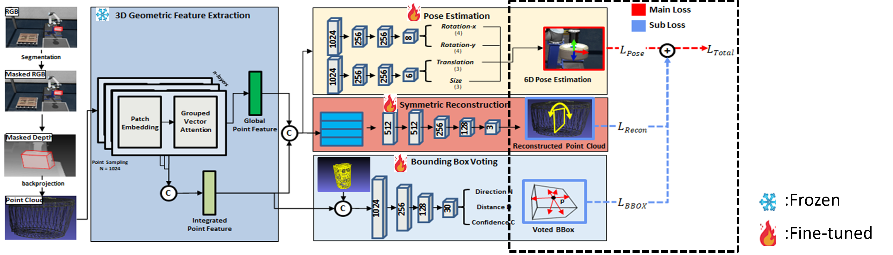
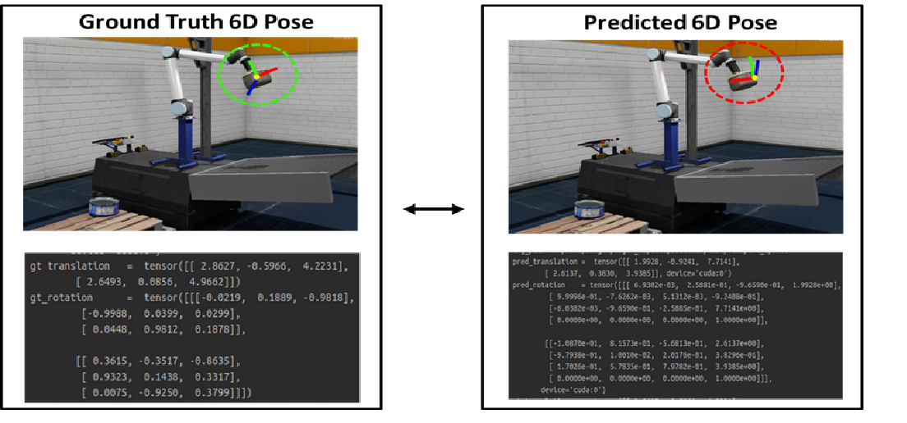

# IsaacSIM-6D Object Pose Estimation (IS-OPE)

---

## Overview
- 사전 학습된 **[GPV-Pose (CVPR '22)](https://github.com/lolrudy/GPV_Pose)** 모델을 직접 수집한 IsaacSIM 데이터셋으로 파인튜닝하여 새로운 도메인에 적용



## Description
- GPV-Pose를 기반으로 제조/물류 환경에서 6D Object Pose 추정 성능을 개선하기 위한 프로젝트입니다.

## Features
- 범주 수준(Category-level) 6D Pose 추정 GPV-Pose 모델을 파인튜닝 하여 제조/물류 도메인에 적용 
- NVIDIA IsaacSIM을 활용하여 Object Pose 추정 모델 학습을 위한 데이터 수집

---

## 📂 Directory Structure
```
├── config/
│   ├── config.py               # 설정값 및 파라미터 관리
├── dataset/
│   ├── load_data.py            # 데이터 로드
├── engine/
│   ├── train.py                # 모델 학습 
├── evaluation/
│   ├── evaluate.py             # 모델 평가 
├── network/
│   ├── FaceRecon.py            # Face Reconstruction
│   ├── gcn3d.py                # 3D_GCN - 기존 백본(기하학적 특징 추출기)
│   ├── PointTransformerV2.py   # PT_V2 - 변경 백본(기하학적 특징 추출기)
│   ├── PoseNet9D.py            # 메인 네트워크
├── result/
│   ├── REAL275/                #(Fine-Tuning 전) 기존 데이터 집합 평가 결과
│   │   ├── results_val_00000_0000.pkl  # 평가 로그 파일
│   ├── ISAACSIM/               #(Fine-Tuning 후) 신규 데이터 집합 평가 결과
├── pretrained_models/ #사전 학습된 모델 저장
```

---

## 🛠️ Dependencies

```bash
    conda create -n ISOPE python=3.8
    conda activate ISOPE
    pip install torch==1.12.1+cu113 torchvision==0.13.1+cu113 torchaudio==0.12.1 --extra-index-url https://download.pytorch.org/whl/cu113
    pip install -r requirements.txt
    
    #Install Detectron2
    git clone https://github.com/facebookresearch/detectron2.git
    cd detectron2
    pip install -e     
```
    
---

## IsaacSIM Dataset Preparation
1. **IsaacSIMDataset 다운로드**: [Link](https://drive.google.com/file/d/1Y9YMRH6dRzuOWFrcVYkAd-rEVgaLTv9j/view)
2. **IsaacSIMObjectModels 다운로드**: [Link](https://drive.google.com/file/d/1owc2MXld1Yw2ITblFigT-pVCY_hDAZzf/view)
- (Option) [CAMERA+REAL Dataset Preparation](https://github.com/Gorilla-Lab-SCUT/DualPoseNet)
3. 데이터 배치:
```
dataset/
├── IsaacSIMDataset/
│   ├── train/
│   ├── val/
├── IsaacSIMObjectModels/
│   ├── object1.obj
│   ├── object2.obj
```
---

## Trained Model
- IsaacSIM 파인튜닝 모델 다운로드: [Link](https://drive.google.com/file/d/1bK99MFeZm7CXVA45xUdvUQ0irtiBKgUV/)
- 사전 학습한 GPV-Pose 모델 다운로드 : [Link](https://drive.google.com/file/d/1V3kkJNHAkr5ZiBO-pxNeujDUA--GRfT7/view)
- 다음 경로에 배치:
```
pretrained_models/
├── fine_tuned_isaccSim.pth
├── gpv_pose_update.pth
```

---

## Run Code

### **Train**

- **(Option#1)** **GPV-Pose 사전학습 모델 로드 후 IsaacSIM 데이터셋에 파인튜닝**
   - **`config.py` 수정**:
     - `training_stage_freeze = 'face_recon'`
     - `resume = 1`
     - `resume_model = [다운받은 가중치 파일 위치]`
     - `dataset = IsaacSIM`
     - `dataset_dir = [다운받은 IsaacSIM 데이터셋 위치]`
     ```bash
     python -m engine.train --data_dir YOUR_DATA_DIR --model_save SAVE_DIR
     ```

- **(Option#2)** **IsaacSIM 데이터셋에 GPV-Pose 전체 모델 학습**
   - **`config.py` 수정**:
     - `training_stage_freeze = ''`
     - `resume = 0`
     - `dataset = IsaacSIM`
     - `dataset_dir = [다운받은 IsaacSIM 데이터셋 위치]`

     ```bash
     python -m engine.train --data_dir YOUR_DATA_DIR --model_save SAVE_DIR
     ```

- **(Option#3)** **기존 GPV-Pose 모델 학습**
   - **`config.py` 수정**:
     - `training_stage_freeze = ''`
     - `resume = 0`
     - `dataset = CAMERA+Real`
     - `dataset_dir = [다운받은 CAMERA+Real 데이터셋 위치]`

   - **명령어**:
     ```bash
     python -m engine.train --data_dir YOUR_DATA_DIR --model_save SAVE_DIR
     ```

### **Evaluation**
- **명령어**:
   ```bash
   python -m evaluation.evaluate --data_dir YOUR_DATA_DIR --detection_dir DETECTION_DIR --resume 1 --resume_model MODEL_PATH --model_save SAVE_DIR
   ```

---

## 학습 데이터 수집 영상
- [](https://www.youtube.com/watch?v=h6-N02f4EH0)

## 정성 평가 결과

---

## Acknowledgment
- 본 프로젝트는 아래 코드들을 활용하여 구현하였습니다.:
  - [PointTransformerV2](https://github.com/Pointcept/PointTransformerV2.git)
  - [GPV_Pose](https://github.com/lolrudy/GPV_Pose)
  - [3D GCN](https://github.com/chih-hao-lin/3dgcn)
  - [FS-Net](https://github.com/DC1991/FS_Net)
  - [DualPoseNet](https://github.com/Gorilla-Lab-SCUT/DualPoseNet)
  - [SPD](https://github.com/mentian/object-deformnet)

